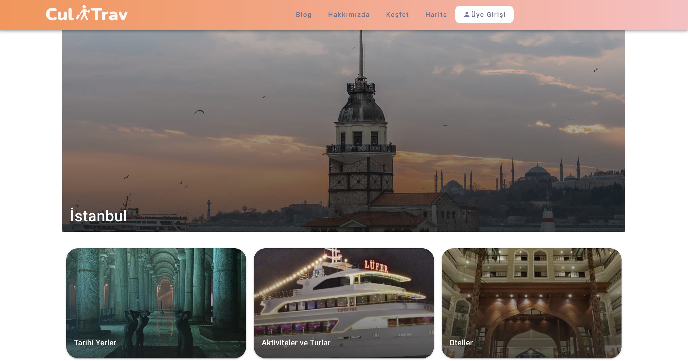
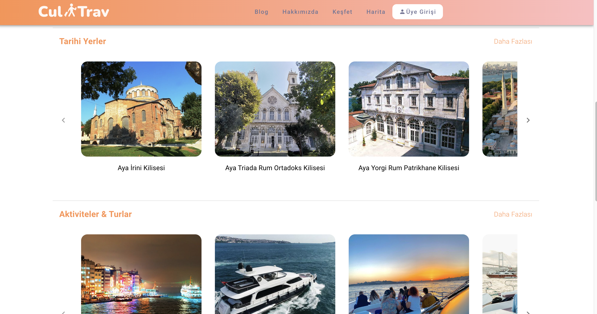

# cultrav-frontend

<!-- PROJECT LOGO -->

    

 

<!-- TABLE OF CONTENTS -->

  
Table of Contents

  <ol>
    <li>
        <a href="#built-with">Built With</a>
    </li>
    <li><a href="#contact">Contact</a></li>
  </ol>

## About The Project

This website is for Cultrav which is an application that offers you information about all the historical places you wonder by using artificial intelligence and image processing technology.

### Built With

- [![Vue][vue.js]][vue-url]
- [![Nuxt][nuxt]][nuxt-url]

(<a href="#readme-top">back to top</a>)

## Pages
#### Home
  
  
#### Login & Register
  
  
#### Register
    
  
#### Blog
  
  
#### About Us
  

#### Discover
  
  
  
  
#### Map
  
  
  

(<a href="#readme-top">back to top</a>)

## Contact

Sefa Karabaş - sefaa.karabas@gmail.com
Project Link: [https://github.com/sefakrb/cultrav-frontend](https://github.com/sefakrb/cultrav-frontend)

(<a href="#readme-top">back to top</a>)

<!-- MARKDOWN LINKS & IMAGES -->
<!-- https://www.markdownguide.org/basic-syntax/#reference-style-links -->

[vue.js]: https://img.shields.io/badge/Vue.js-35495E?style=for-the-badge&logo=vuedotjs&logoColor=4FC08D
[vue-url]: https://vuejs.org/
[nuxt]: https://img.shields.io/badge/Nuxt-002E3B?style=for-the-badge&logo=nuxtdotjs&logoColor=#00DC82
[nuxt-url]: https://nuxtjs.org/
